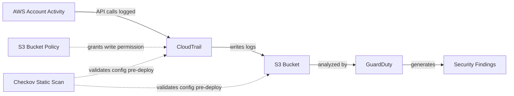

# Cloud SIEM Detection Lab

## Project Overview

This is a personal lab project demonstrating cloud security infrastructure built entirely with **Terraform** (Infrastructure as Code), designed to log account activity via **Amazon CloudTrail** into an **Amazon S3** bucket, and detect threats against that activity using **Amazon GuardDuty**. The project also integrates **Checkov**, a static analysis security scanner, to catch infrastructure misconfigurations before deployment — demonstrating a "shift-left" security approach alongside GuardDuty's runtime threat detection.

The goal was to gain practical, hands-on skills directly relevant to SOC Analyst and Cloud Security roles — building detection infrastructure the way it's actually done in industry, rather than clicking through the AWS console.

This is a solo academic project, built and torn down within a short window to responsibly manage AWS costs (see Teardown Note below).

## Architecture

The S3 bucket policy had to be created *before* CloudTrail, since CloudTrail validates write access to its target bucket at creation time — see Debugging section below for how this played out in practice. Checkov runs against the Terraform code itself, before any `apply`, catching misconfigurations pre-deployment rather than after.

## Key Findings (GuardDuty)

### 1. Attack Sequence: Potential S3 Data Compromise (Critical)

GuardDuty's **Attack Sequence** detection correlated 14 separate signals into a single finding tied to `IAMUser/john_doe` — indicating that identity's credentials were used maliciously, not merely referenced. The sequence began with a `ListBuckets` API call from a Tor exit node (reconnaissance) and progressed to a `DeleteObject` call from a host associated with Kali Linux (exfiltration/impact). GuardDuty mapped this directly onto the **MITRE ATT&CK framework**, spanning Reconnaissance, Discovery, Persistence, Defense Evasion, and Exfiltration tactics. This demonstrates GuardDuty's behavioral, multi-signal detection — correlating a chain of individually weak signals into one high-confidence alert, rather than flagging isolated events.

### 2. S3 Bucket: Public Anonymous Access Granted (High)

GuardDuty detected that an S3 bucket's permissions were changed to allow public, unauthenticated access. This finding flags the *exposure itself* — a common and genuinely dangerous real-world misconfiguration, since publicly accessible buckets are a frequent root cause of actual data breaches. This finding class is valuable because it catches the mistake before any attacker needs to exploit it.

### 3. RDS: Login Attempt from Known-Malicious IP (Medium)

GuardDuty flagged a login attempt against an RDS database originating from an IP address on AWS's threat intelligence list of known malicious actors. The attempt was unsuccessful, but this shouldn't be read as low-priority — failed authentication from a known-bad IP is often an early indicator of active reconnaissance or credential-stuffing, and a SOC analyst would treat this as a signal to watch for a broader pattern, not dismiss.

## Static Analysis with Checkov

To complement GuardDuty's runtime detection, this project uses **Checkov** to scan the Terraform code itself for misconfigurations before deployment. Checkov reads `.tf` files as static text — it never touches AWS or incurs any cost — and checks them against a broad rule set of security best practices.

### Fixes Applied

An initial scan (19 passed / 13 failed) surfaced several genuine, zero-cost hardening opportunities, which were implemented directly:

| Finding | Fix |
|---|---|
| `CKV_AWS_67` — CloudTrail not multi-region | Added `is_multi_region_trail = true` so activity in every AWS region is captured, not just the deployment region |
| `CKV_AWS_36` — Log file validation disabled | Added `enable_log_file_validation = true`, enabling cryptographic digest files so log tampering can be detected |
| `CKV_AWS_21` — S3 versioning disabled | Added an `aws_s3_bucket_versioning` resource to protect log files against accidental or malicious deletion |
| `CKV2_AWS_6` — No S3 Public Access Block | Added an `aws_s3_bucket_public_access_block` resource as a defense-in-depth layer, independent of the bucket policy |
| `CKV2_AWS_61` — No lifecycle configuration | Added an `aws_s3_bucket_lifecycle_configuration` resource expiring log objects after 30 days |

Enabling multi-region logging also prompted a related fix: `include_global_service_events` was changed from `false` to `true`, since excluding global services (like IAM) from a security-monitoring trail would blind it to exactly the kind of activity — privilege escalation, new access keys — that matters most.

Re-running Checkov after these changes confirmed all five findings resolved, with the public access block resource also passing four additional related checks (`CKV_AWS_53`, `CKV_AWS_54`, `CKV_AWS_55`, `CKV_AWS_56`) — bringing the result to 28 passed / 9 failed.

### Findings Consciously Accepted (Not Fixed)

The remaining 9 findings were evaluated and deliberately not implemented, each for a specific reason rather than left unaddressed by oversight:

| Finding | Reasoning |
|---|---|
| `CKV_AWS_35`, `CKV_AWS_145` — KMS encryption | The bucket already uses default AES-256 encryption at rest. A KMS Customer Managed Key adds a small recurring cost (~$1/month) that isn't justified for a lab with no sensitive production data. |
| `CKV_AWS_144` — Cross-region replication | A disaster-recovery feature intended for production systems; doubles storage cost with no benefit to a temporary lab. |
| `CKV2_AWS_10` — CloudTrail/CloudWatch integration | Would enable real-time alerting at a small ongoing cost. Noted as a genuine future enhancement rather than dismissed. |
| `CKV_AWS_252` — No SNS topic defined | Low priority with no current consumer to notify; would add an unused resource. |
| `CKV_AWS_18` — S3 access logging | Requires a second, separate bucket to receive access logs — disproportionate infrastructure for this lab's scope. |
| `CKV_AWS_300` — No multipart upload abort rule | Not applicable: CloudTrail writes small, single-request log files, so multipart uploads never occur in this bucket's actual usage pattern. |
| `CKV2_AWS_3` — GuardDuty org/region check | A structural false positive — this check targets multi-account AWS Organizations setups; this project uses a single personal account. |
| `CKV2_AWS_62` — S3 event notifications | This is an automation feature (triggering Lambda/SNS on upload), not a security gap by itself. |

## Debugging & Challenges

While building the S3 bucket policy that grants CloudTrail write access, I hit a permission failure caused by an ARN mismatch. The IAM policy's `SourceArn` condition needs to reference the CloudTrail trail by its real, AWS-facing name — but because the trail didn't exist yet at the moment the policy was being created (CloudTrail requires the policy to exist *first*, since AWS validates write access as part of trail creation), Terraform couldn't auto-fetch that ARN as a live reference the way it could for the already-existing S3 bucket. Instead, the ARN had to be manually constructed as a string from account ID, region, and partition data sources — which meant it could silently drift out of sync with the trail's actual name if not updated carefully. I caught this by comparing `terraform plan` output line-by-line against my resource definitions, and fixed it by ensuring the hardcoded trail name in the policy exactly matched the real `name` argument on the `aws_cloudtrail` resource.

## Teardown Note

GuardDuty was deliberately built, evaluated, and torn down within its 30-day free trial window to avoid incurring costs beyond this lab's intended scope. CloudTrail and S3 logging infrastructure — including the hardening improvements above — remain lightweight, low-cost components suitable for longer-term use, and were rebuilt after the Checkov hardening pass to verify the final configuration end-to-end.