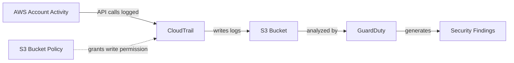
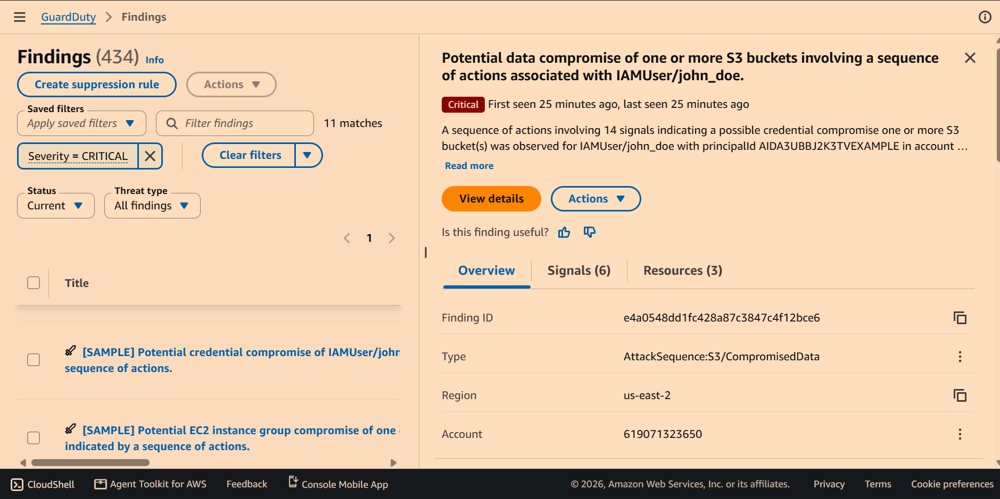
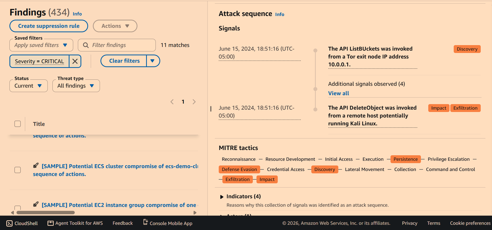
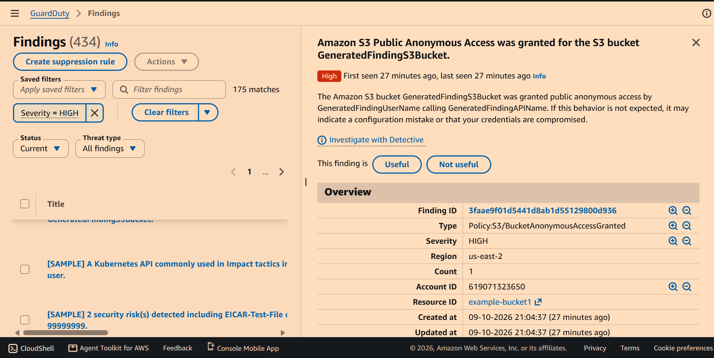
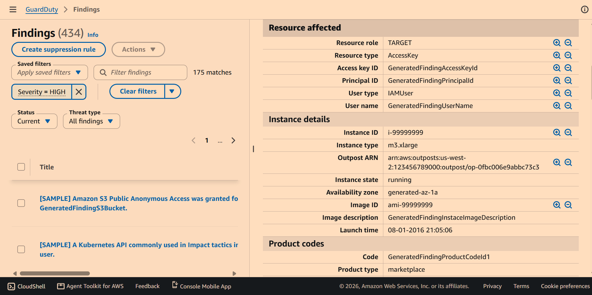
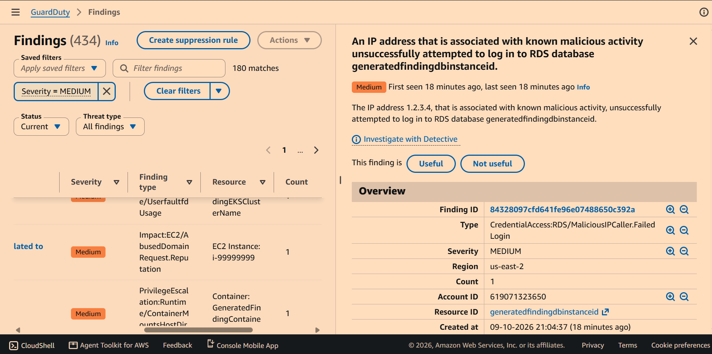
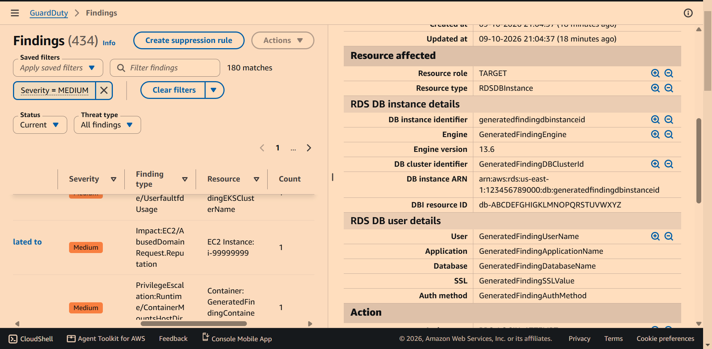

# Cloud SIEM Detection Lab

## Project Overview

This is a personal lab project demonstrating cloud security infrastructure built entirely with **Terraform** (Infrastructure as Code), designed to log account activity via **Amazon CloudTrail** into an **Amazon S3** bucket, and detect threats against that activity using **Amazon GuardDuty**. The goal was to gain practical, hands-on skills directly relevant to SOC Analyst and Cloud Security roles — building detection infrastructure the way it's actually done in industry, rather than clicking through the AWS console.

This is a solo academic project, built and torn down within a short window to responsibly manage AWS costs (see Teardown Note below).

## Architecture

The S3 bucket policy had to be created *before* CloudTrail, since CloudTrail validates write access to its target bucket at creation time — see Debugging section below for how this played out in practice.

## Key Findings

### 1. Attack Sequence: Potential S3 Data Compromise (Critical)

GuardDuty's **Attack Sequence** detection correlated 14 separate signals into a single finding tied to `IAMUser/john_doe` — indicating that identity's credentials were used maliciously, not merely referenced. The sequence began with a `ListBuckets` API call from a Tor exit node (reconnaissance) and progressed to a `DeleteObject` call from a host associated with Kali Linux (exfiltration/impact). GuardDuty mapped this directly onto the **MITRE ATT&CK framework**, spanning Reconnaissance, Discovery, Persistence, Defense Evasion, and Exfiltration tactics. This demonstrates GuardDuty's behavioral, multi-signal detection — correlating a chain of individually weak signals into one high-confidence alert, rather than flagging isolated events.

### 2. S3 Bucket: Public Anonymous Access Granted (High)

GuardDuty detected that an S3 bucket's permissions were changed to allow public, unauthenticated access. This finding flags the *exposure itself* — a common and genuinely dangerous real-world misconfiguration, since publicly accessible buckets are a frequent root cause of actual data breaches. This finding class is valuable because it catches the mistake before any attacker needs to exploit it.

### 3. RDS: Login Attempt from Known-Malicious IP (Medium)

GuardDuty flagged a login attempt against an RDS database originating from an IP address on AWS's threat intelligence list of known malicious actors. The attempt was unsuccessful, but this shouldn't be read as low-priority — failed authentication from a known-bad IP is often an early indicator of active reconnaissance or credential-stuffing, and a SOC analyst would treat this as a signal to watch for a broader pattern, not dismiss.

## Debugging & Challenges

While building the S3 bucket policy that grants CloudTrail write access, I hit a permission failure caused by an ARN mismatch. The IAM policy's `SourceArn` condition needs to reference the CloudTrail trail by its real, AWS-facing name — but because the trail didn't exist yet at the moment the policy was being created (CloudTrail requires the policy to exist *first*, since AWS validates write access as part of trail creation), Terraform couldn't auto-fetch that ARN as a live reference the way it could for the already-existing S3 bucket. Instead, the ARN had to be manually constructed as a string from account ID, region, and partition data sources — which meant it could silently drift out of sync with the trail's actual name if not updated carefully. I caught this by comparing `terraform plan` output line-by-line against my resource definitions, and fixed it by ensuring the hardcoded trail name in the policy exactly matched the real `name` argument on the `aws_cloudtrail` resource.

## Teardown Note

GuardDuty was deliberately built, evaluated, and torn down within its 30-day free trial window to avoid incurring costs beyond this lab's intended scope. CloudTrail and S3 logging infrastructure remain lightweight, low-cost components suitable for longer-term use.