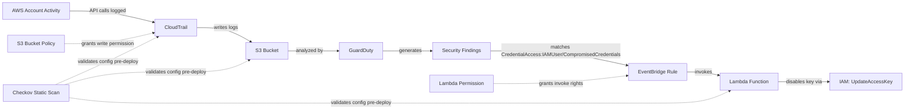
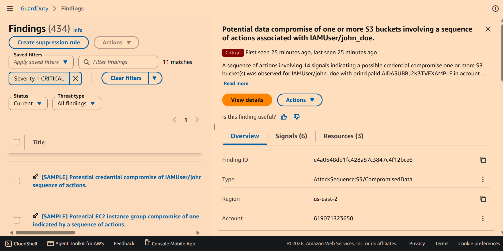
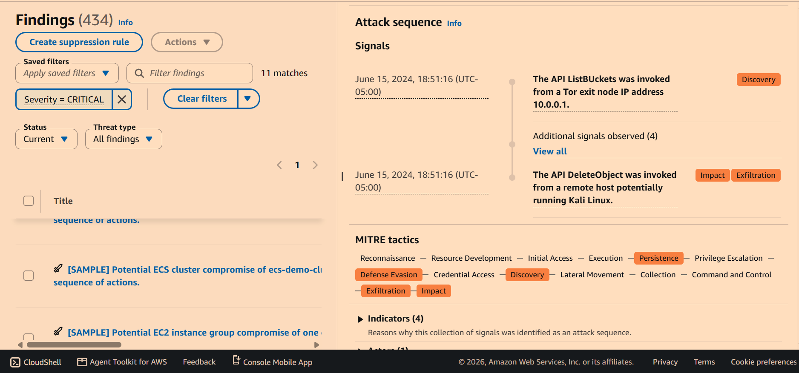
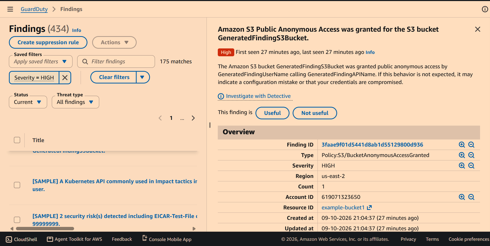
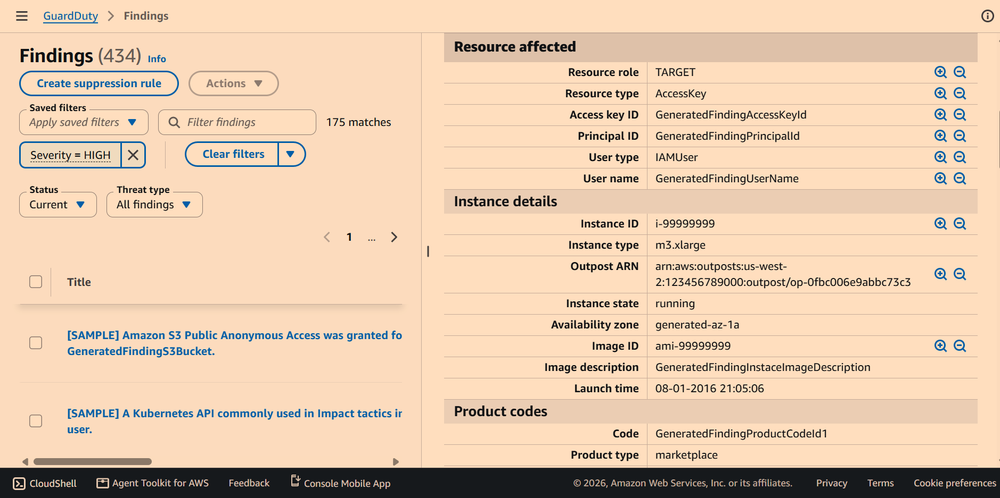
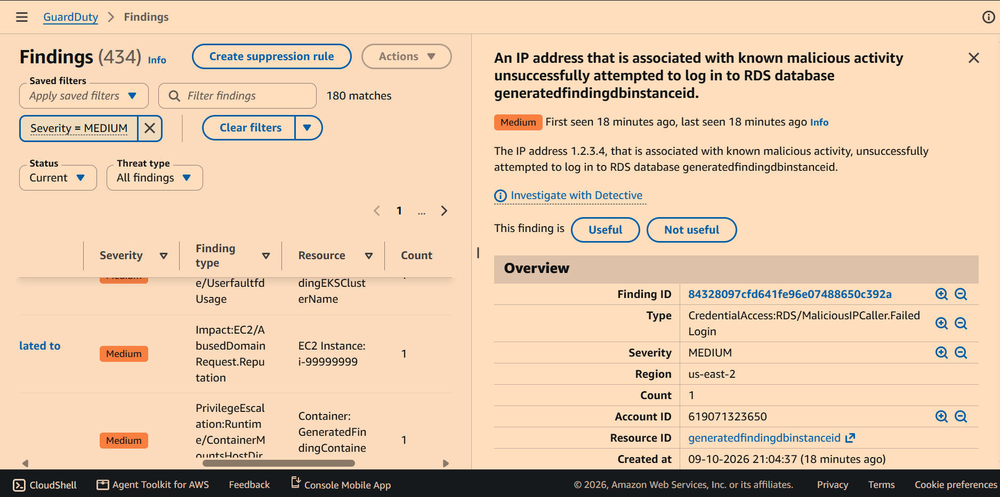
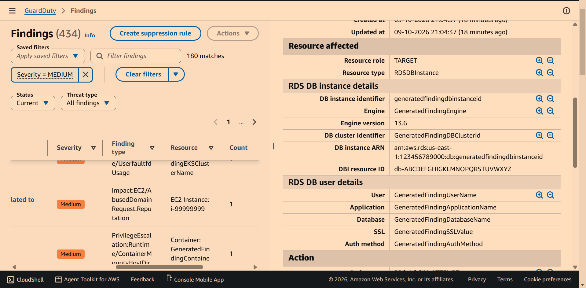
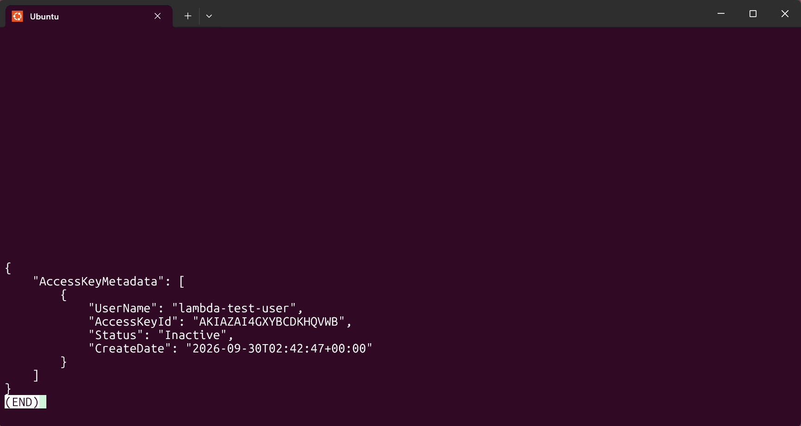

# Cloud SIEM Detection Lab

## Project Overview

This is a personal lab project demonstrating cloud security infrastructure built entirely with **Terraform** (Infrastructure as Code). It logs account activity via **Amazon CloudTrail** into an **Amazon S3** bucket, detects threats against that activity using **Amazon GuardDuty**, and automatically **remediates** a specific high-confidence threat type using **EventBridge** and **AWS Lambda**. The project also integrates **Checkov**, a static analysis security scanner, to catch infrastructure misconfigurations before deployment — demonstrating a "shift-left" security approach alongside GuardDuty's runtime detection and Lambda's automated response.

The goal was to gain practical, hands-on skills directly relevant to SOC Analyst and Cloud Security roles — building detection, prevention, and response infrastructure the way it's actually done in industry, rather than clicking through the AWS console.

This is a solo academic project, built and torn down within short windows to responsibly manage AWS costs (see Teardown Note below).

## Architecture


```mermaid
flowchart LR
    A[AWS Account Activity] -->|API calls logged| B[CloudTrail]
    B -->|writes logs| C[S3 Bucket]
    C -->|analyzed by| D[GuardDuty]
    D -->|generates| E[Security Findings]
    E -->|matches CredentialAccess:IAMUser/CompromisedCredentials| F[EventBridge Rule]
    F -->|invokes| G[Lambda Function]
    G -->|disables key via| H[IAM: UpdateAccessKey]

    I[S3 Bucket Policy] -.->|grants write permission| B
    J[Lambda Permission] -.->|grants invoke rights| F
    K[Checkov Static Scan] -.->|validates config pre-deploy| C
    K -.->|validates config pre-deploy| B
    K -.->|validates config pre-deploy| G
```

The S3 bucket policy had to be created *before* CloudTrail, since CloudTrail validates write access to its target bucket at creation time — see Debugging section below. Checkov runs against the Terraform code itself, before any `apply`, catching misconfigurations pre-deployment rather than after.

## Key Findings (GuardDuty)

### 1. Attack Sequence: Potential S3 Data Compromise (Critical)

GuardDuty's **Attack Sequence** detection correlated 14 separate signals into a single finding tied to `IAMUser/john_doe` — indicating that identity's credentials were used maliciously, not merely referenced. The sequence began with a `ListBuckets` API call from a Tor exit node (reconnaissance) and progressed to a `DeleteObject` call from a host associated with Kali Linux (exfiltration/impact). GuardDuty mapped this directly onto the **MITRE ATT&CK framework**, spanning Reconnaissance, Discovery, Persistence, Defense Evasion, and Exfiltration tactics. This demonstrates GuardDuty's behavioral, multi-signal detection — correlating a chain of individually weak signals into one high-confidence alert, rather than flagging isolated events.




### 2. S3 Bucket: Public Anonymous Access Granted (High)

GuardDuty detected that an S3 bucket's permissions were changed to allow public, unauthenticated access. This finding flags the *exposure itself* — a common and genuinely dangerous real-world misconfiguration, since publicly accessible buckets are a frequent root cause of actual data breaches. This finding class is valuable because it catches the mistake before any attacker needs to exploit it.




### 3. RDS: Login Attempt from Known-Malicious IP (Medium)

GuardDuty flagged a login attempt against an RDS database originating from an IP address on AWS's threat intelligence list of known malicious actors. The attempt was unsuccessful, but this shouldn't be read as low-priority — failed authentication from a known-bad IP is often an early indicator of active reconnaissance or credential-stuffing, and a SOC analyst would treat this as a signal to watch for a broader pattern, not dismiss.




## Automated Remediation: Compromised IAM Credentials

Detection alone isn't enough for high-confidence, low-ambiguity threats — a human doesn't need to be watching a dashboard in real time to respond to a finding that Amazon's own threat intelligence has already confirmed. This project adds an automated response for exactly one such finding type: **`CredentialAccess:IAMUser/CompromisedCredentials`**, GuardDuty's High-severity finding indicating a specific IAM access key — known to be compromised (e.g. leaked publicly) — was actually used to call AWS APIs in the account.

Unlike GuardDuty's ML-driven anomaly findings (e.g. `AnomalousBehavior`, which carries real false-positive risk), this finding is only raised on confirmed-bad credentials already in active use, making it a reasonable candidate for automated action without human review.

### Architecture of the response

1. **GuardDuty** generates the finding
2. An **EventBridge rule** matches on `source: aws.guardduty` and `detail.type: CredentialAccess:IAMUser/CompromisedCredentials` specifically — all other finding types pass through untouched
3. The rule invokes a **Lambda function**, which extracts the compromised user's name and access key ID from the event and calls `iam:UpdateAccessKey` to set the key's status to `Inactive`
4. An **IAM role**, scoped to only `iam:UpdateAccessKey` on `arn:aws:iam::<account>:user/*` plus the three CloudWatch Logs actions needed to log the function's own execution, is assumed by the Lambda function at runtime

### Testing

A real `CompromisedCredentials` finding can't be generated on demand (it requires Amazon's own threat intelligence to flag a key), so the pipeline was validated in two independent tests covering the wiring and the actual remediation separately.

**Test A — wiring, via GuardDuty's sample-finding generator:**
```bash
aws guardduty create-sample-findings --detector-id <id> \
  --finding-types "CredentialAccess:IAMUser/CompromisedCredentials"
```
This confirmed GuardDuty → EventBridge → Lambda invocation worked end-to-end. Since the sample finding names a fictional user (`GeneratedFindingUserName`), the function correctly caught the resulting `NoSuchEntity` error from IAM and logged the failure — proving both the invocation path and the error-handling path work as designed.

**Test B — actual remediation, via a real throwaway IAM user:**
A disposable IAM user and access key were created via the CLI, and the function was manually invoked with a test event matching the real finding's JSON shape
The result (before remediation):




Confirmed independently via `aws iam list-access-keys` — the key's status changed from `Active` to `Inactive`, proving the actual AWS-side remediation, not just a log message claiming success.
The result(after remediation)


### Known limitations (documented, not fixed)

- **The function can't tell EventBridge it failed.** `update_access_key` failures are caught and logged, but the function still returns normally, so Lambda reports every invocation as successful regardless of outcome. A production version would re-raise the exception (or push to a dead-letter queue) so failed remediations trigger an alert rather than a silently unread log line.
- **The role can disable any IAM user's access keys in the account**, since the compromised user isn't known in advance. This is a deliberate least-privilege tradeoff (see `CKV_AWS_111` below), not an oversight.
- **GuardDuty's sample-finding generator produced two separate invocations** for a single `create-sample-findings` call, roughly three minutes apart (visible as two distinct RequestIds in CloudWatch Logs). The remediation action here is naturally idempotent — disabling an already-inactive key is a harmless no-op — but this was a useful, concrete reminder that automated remediation actions should be designed to tolerate duplicate or repeated invocations.

## Static Analysis with Checkov

To complement GuardDuty's runtime detection, this project uses **Checkov** to scan the Terraform code itself for misconfigurations before deployment. Checkov reads `.tf` files as static text — it never touches AWS or incurs any cost — and checks them against a broad rule set of security best practices.

### Fixes Applied

An initial scan of the logging infrastructure (19 passed / 13 failed) surfaced several genuine, zero-cost hardening opportunities, which were implemented directly:

| Finding | Fix |
|---|---|
| `CKV_AWS_67` — CloudTrail not multi-region | Added `is_multi_region_trail = true` so activity in every AWS region is captured, not just the deployment region |
| `CKV_AWS_36` — Log file validation disabled | Added `enable_log_file_validation = true`, enabling cryptographic digest files so log tampering can be detected |
| `CKV_AWS_21` — S3 versioning disabled | Added an `aws_s3_bucket_versioning` resource to protect log files against accidental or malicious deletion |
| `CKV2_AWS_6` — No S3 Public Access Block | Added an `aws_s3_bucket_public_access_block` resource as a defense-in-depth layer, independent of the bucket policy |
| `CKV2_AWS_61` — No lifecycle configuration | Added an `aws_s3_bucket_lifecycle_configuration` resource expiring log objects after 30 days |

Enabling multi-region logging also prompted a related fix: `include_global_service_events` was changed from `false` to `true`, since excluding global services (like IAM) from a security-monitoring trail would blind it to exactly the kind of activity — privilege escalation, new access keys — that matters most.

When the Lambda auto-remediation resources were added, an initial IAM policy draft scoped the CloudWatch Logs actions to a bare `"*"` resource. Rather than leave it (as originally planned), the policy was split into two statements — one scoping `logs:CreateLogGroup` to the account/region, and one scoping `logs:CreateLogStream`/`logs:PutLogEvents` to the function's specific log group ARN, built dynamically via `${aws_lambda_function.lambda_iam_handler.function_name}`. This cleared `CKV_AWS_356` (no bare `"*"` for restrictable actions) and, as a side effect, also cleared `CKV_AWS_111` (write access without constraints) on the same policy.

Re-running Checkov after the logging-infrastructure fixes brought the result to 28 passed / 9 failed. Adding the Lambda resources introduced 5 further, Lambda-specific findings (all consciously accepted — see below), and a CI-only finding (`CKV2_GHA_1`, GitHub Actions default token permissions) was also fixed by adding an explicit `permissions: contents: read` to the workflow.

### Findings Consciously Accepted (Not Fixed)

The remaining 14 findings were evaluated and deliberately not implemented, each for a specific reason rather than left unaddressed by oversight:

| Finding | Reasoning |
|---|---|
| `CKV_AWS_35`, `CKV_AWS_145` — KMS encryption | The bucket already uses default AES-256 encryption at rest. A KMS Customer Managed Key adds a small recurring cost (~$1/month) that isn't justified for a lab with no sensitive production data. |
| `CKV_AWS_144` — Cross-region replication | A disaster-recovery feature intended for production systems; doubles storage cost with no benefit to a temporary lab. |
| `CKV2_AWS_10` — CloudTrail/CloudWatch integration | Would enable real-time alerting at a small ongoing cost. Noted as a genuine future enhancement rather than dismissed. |
| `CKV_AWS_252` — No SNS topic defined | Low priority with no current consumer to notify; would add an unused resource. |
| `CKV_AWS_18` — S3 access logging | Requires a second, separate bucket to receive access logs — disproportionate infrastructure for this lab's scope. |
| `CKV_AWS_300` — No multipart upload abort rule | Not applicable: CloudTrail writes small, single-request log files, so multipart uploads never occur in this bucket's actual usage pattern. |
| `CKV2_AWS_3` — GuardDuty org/region check | A structural false positive — this check targets multi-account AWS Organizations setups; this project uses a single personal account. |
| `CKV2_AWS_62` — S3 event notifications | This is an automation feature (triggering Lambda/SNS on upload), not a security gap by itself. |
| `CKV_AWS_117` — Lambda inside a VPC | Reaching the IAM API from inside a VPC would require a NAT gateway, which bills hourly and isn't justified for a lab function invoked a handful of times. |
| `CKV_AWS_116` — Dead-letter queue | Worth noting this is more than a cost tradeoff: as documented above, the function currently swallows its own failures and returns normally, so a DLQ wouldn't catch a failed remediation anyway without also re-raising the exception. Flagged as a genuine future improvement. |
| `CKV_AWS_272` — Code signing | Requires extra signing infrastructure not worth setting up for one lab function. |
| `CKV_AWS_115` — Concurrency limit | The function only fires on one rare, specific finding type; a concurrency cap adds little protection at this scale. |
| `CKV_AWS_50` — X-Ray tracing | Requires additional IAM permissions for a function invoked a handful of times total; limited value here. |

## Debugging & Challenges

**CloudTrail/S3 policy ARN mismatch.** While building the S3 bucket policy that grants CloudTrail write access, I hit a permission failure caused by an ARN mismatch. The IAM policy's `SourceArn` condition needs to reference the CloudTrail trail by its real, AWS-facing name — but because the trail didn't exist yet at the moment the policy was being created (CloudTrail requires the policy to exist *first*, since AWS validates write access as part of trail creation), Terraform couldn't auto-fetch that ARN as a live reference the way it could for the already-existing S3 bucket. Instead, the ARN had to be manually constructed as a string from account ID, region, and partition data sources — which meant it could silently drift out of sync with the trail's actual name if not updated carefully. I caught this by comparing `terraform plan` output line-by-line against my resource definitions, and fixed it by ensuring the hardcoded trail name in the policy exactly matched the real `name` argument on the `aws_cloudtrail` resource.

**JSON vs. HCL syntax when writing Lambda test events.** When building the manual test event for the Lambda function (Test B above), an early draft mixed HCL syntax (`key = value`, used throughout this project's Terraform code) into what needed to be valid JSON (`"key": "value"`). A second early draft mistakenly tried to embed the function's own Python dictionary-access code (`event["detail"]["resource"]...`) directly as the test event's content, rather than recognizing that the JSON *is* the data the Python code reads — not a place to repeat the reading logic itself. Building the nested structure one level at a time (`detail` → `resource` → `accessKeyDetails`) rather than attempting it all at once resolved both issues.

**AWS CLI default region mismatch.** All infrastructure in this project lives in `us-east-2`, but the AWS CLI's configured default region was `us-east-1`. This caused a misleading `BadRequestException: detectorId is not owned by the current account` error when trying to generate a sample GuardDuty finding — the detector genuinely existed, just not in the region the CLI was looking in. Rather than change the CLI's global default (which could affect other unrelated work), every AWS CLI command for this project explicitly passes `--region us-east-2`.

**Lambda default timeout.** The initial Lambda function configuration used AWS's 3-second default timeout. The function's actual execution (boto3 client initialization plus the IAM API call) took approximately 2.6 seconds in testing — uncomfortably close to that limit, and enough to risk failing under slightly slower cold-start conditions. `timeout` was explicitly set to 10 seconds to give the function reliable headroom.

### Continuous Integration

Checkov runs automatically on every push to `main` via **GitHub Actions**, using the official `bridgecrewio/checkov-action`. The workflow is configured to fail the build only on genuinely new, unaddressed findings — the 13 checks documented above as consciously accepted risks are explicitly skipped via the `skip_check` input, so the pipeline's pass/fail status reflects real regressions rather than known, deliberate decisions. This turns the risk-acceptance table above from documentation into an enforced policy: if a future change accidentally undoes one of the hardening fixes, the pipeline will correctly fail and flag it.

The workflow also sets explicit `permissions: contents: read` at the top level, rather than relying on the default (broader) token permissions GitHub Actions grants otherwise.

The workflow definition lives at `.github/workflows/checkov.yml`.

## Teardown Note

GuardDuty and the Lambda auto-remediation resources were deliberately built, evaluated, and torn down within short windows to avoid incurring costs beyond this lab's intended scope and to respect GuardDuty's 30-day free trial. All 13 resources (S3, CloudTrail, GuardDuty, EventBridge, IAM, and Lambda) were destroyed via `terraform destroy` after testing. Resources created outside of Terraform for testing purposes — a throwaway IAM test user/key, and the Lambda function's auto-created CloudWatch log group — were removed manually via the AWS CLI, since Terraform only manages what it directly creates. The full infrastructure remains reproducible from this repository via `terraform apply` at any time.
